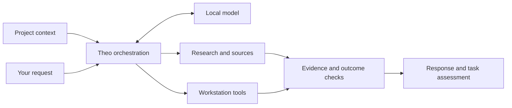

# Christopher M. ("Brutal") | BrutalFoundry

**Software Developer | Systems Engineering, Automation & Applied AI**

**Looking for BrutalDash?** [Downloads and release notes](https://github.com/Brutal-BrutalFoundry/BrutalDash/releases) · [Installation guide](https://github.com/Brutal-BrutalFoundry/BrutalDash/blob/main/INSTALLATION.md) · [Features](https://github.com/Brutal-BrutalFoundry/BrutalDash/blob/main/FEATURES.md)

Hi, I'm Brutal, the developer behind BrutalFoundry.

I build software because I like solving hard problems and turning ideas into working systems. My projects range from released Windows software to AI tooling, local model infrastructure, automation, and whatever else is interesting enough to build.

Welcome to my developer home. You'll find projects I'm building, software I've released, and notes on the work as it develops.

## Current projects

### Cyllaris

**Your AI, working with your PC. You control the permitted work.**

Cyllaris is a control layer between AI intent and machine execution, focused on authorization, verification, and keeping execution authority outside the model. It is being built to connect your chosen AI with files and installed tools on Windows, carrying permitted actions and their results through your conversation. Its intended uses include personal projects, professional workflows and technical work.

**[Try the interactive demo](https://brutal-brutalfoundry.github.io/Cyllaris/)** · [Explore the technical showcase](https://github.com/Brutal-BrutalFoundry/Cyllaris)

*Private source. In development. The demo uses fictional data and runs entirely in your browser, with no download or access to your PC.*

### Project Theo

**Private personal system · In active development · No public release planned**

**A local AI assistant built around my workstation and ongoing projects.**

*Conceptual architecture. Individual tool results do not establish that an entire task succeeded.*

The name Theo is drawn from Prometheus. Theo is the local AI system I build for my own workstation. Its goal spans research, reasoning, writing, persistent project memory, computer assistance, and application development. The implemented foundation brings together local inference, project context, tool orchestration, and source-linked research on Windows.

I use Theo for research and development while working on persistent project context, tool use, and local model orchestration. Current work includes research provenance and citation validation, context recovery, model lifecycle management, command approval, and reliable recovery under real RAM and VRAM constraints. These pieces are still being developed and validated.

[Explore Project Theo](https://github.com/Brutal-BrutalFoundry/Project-Theo)

### BrutalDash

**Public source · Released software**
<table>
<tr>
<td width="50%"> <strong>Telemetry and media</strong></td>
<td width="50%"> <strong>Gaming Focus</strong></td>
</tr>
<tr>
<td width="50%"> <strong>Device Battery</strong></td>
<td width="50%"> <strong>Local inference and memory alerts</strong></td>
</tr>
</table>

*Screenshots from BrutalDash v0.1.60 and v0.1.61. Select an image to view it at full size. Hardware and readings are examples from one PC.*

BrutalDash turns a BridgeThing-powered Car Thing into a customizable Windows PC telemetry dashboard. It combines hardware readings, game performance, device battery information, and local inference monitoring with saved layouts and themes.

I continue to improve BrutalDash through everyday use, with work on Windows integration, device support, saved settings, and the experience of installing and using it.

[Browse the project](https://github.com/Brutal-BrutalFoundry/BrutalDash) · [Downloads](https://github.com/Brutal-BrutalFoundry/BrutalDash/releases) · [Installation](https://github.com/Brutal-BrutalFoundry/BrutalDash/blob/main/INSTALLATION.md)

### BrutalPanel

**Private source · In development**

BrutalPanel is a standalone Windows dashboard project building on the experience behind BrutalDash. The goal is to let people shape a performance dashboard around their PC, with editable layouts, personal backgrounds, and portable designs that adapt to another machine’s hardware.

Development is at the foundation stage. Standalone hosting, local telemetry, customization, and reliable import and recovery are the next engineering milestones. BrutalDash remains the separate, free Car Thing edition.

Thanks for stopping by. Feel free to explore the projects, try a release, or get in touch.

## Get in touch

For project enquiries or collaboration, email [BrutalFoundry@gmail.com](mailto:BrutalFoundry@gmail.com).

Built by Brutal.
